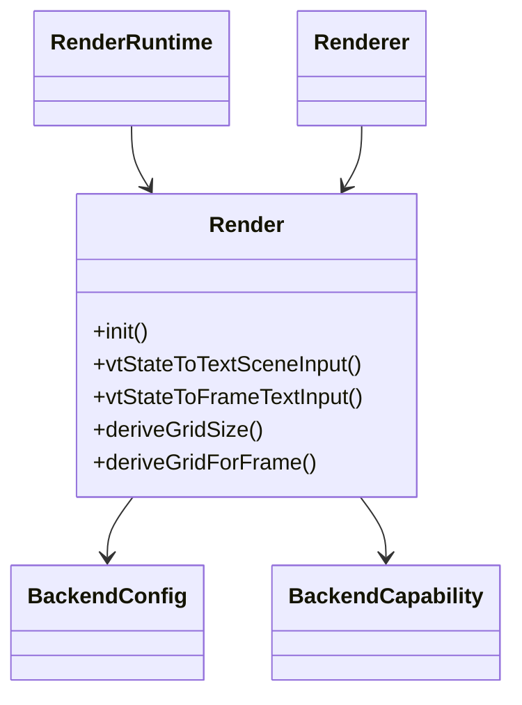
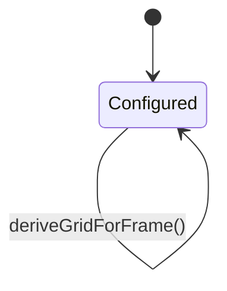
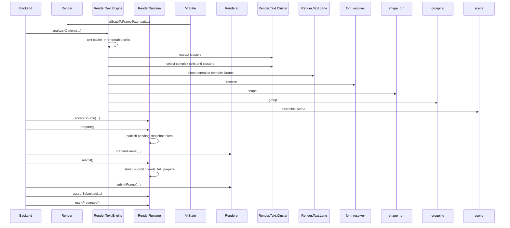

# Design

Shared rules: [`../../design/design-rules.md`](../../design/design-rules.md)

## Purpose
`howl-render` owns the backend-neutral rendering contract.

It turns render-facing terminal state into validated frame inputs, retained publication state, shared text contracts, and backend submission surfaces.

## Public Surface
- `Render`: main render owner.
- `Renderer`: selected backend owner surface.
- `Ffi`: C ABI translation surface when enabled.

## Ownership Rules
- `Render` is the public owner surface for render-facing types, VT conversion, geometry derivation, and runtime contracts.
- `Renderer` owns selected backend behavior and prepared-frame lifetime.
- GL and GLES should expose the same staged backend spine to `Renderer`: prepare frame, upload/consume raster outputs, submit frame.
- `Render.Text` owns the public text support surface. `Render.Text.Lane` is the text-lane contract owner.
- `Ffi` translates ABI contracts only; it does not own render policy.
- `RenderRuntime` keeps retained publication mutation local before handing snapshot tokens to the frame queue.
- Backend repos should depend on these contracts, not re-invent them privately.
- `GlyphQuad` is final GPU submission data. It is not the shaping input model.
- Font and glyph decisions should flow through a kitty-style text path: cell text -> resolved runs -> shaped glyph groups -> sprite/atlas positions -> glyph quads.

## Lifecycle

## Main Flows

## API Contracts
- `Render` owns render-facing types, VT-to-frame/text conversion, and geometry derivation.
- `RenderRuntime` owns retained publication state, geometry epochs, prepare/submit queueing, and metrics.
- retained publication storage, source classification, and pending-publication state mutate in one local runtime owner path.
- queue state reports explicit prepare/submit transitions; runtime decides when rejected submit turns into a full-prepare request.
- runtime metric contracts live in `frame_metrics.zig`; queue transition counters mutate only at the queue transition that they count.
- `Render.Text.Engine` owns the active text control spine: input acceptance, cluster extraction, lane branching, resolve, shape, grouping, and scene assembly.
- `Render.Text.Cluster` owns extraction and complex-path selection over text/cache/cell data, then stops.
- `grouping` owns grouping policy only.
- `scene` owns scene assembly only.
- `rasterizer` owns text sprite raster-request construction, request-list dedupe, generated special sprite raster policy, and raster execution contracts.
- `atlas_cache` owns sprite residency mutation: reserve slot, keep pending residency visible until raster completes, and mark entries rendered.
- `sprite_key` owns sprite output identity only; it does not own residency mutation.
- `Render.Text.Lane`, `font_resolver`, `shape_run`, `grouping`, and `scene` stay leaf phase owners under the engine spine; they do not own top-level routing.
- `Renderer` owns backend selection, backend-facing prepare/submit behavior, and prepared-frame lifetime.
- backend root files own control flow only: prepare shared frame input, consume shared text analysis, upload atlas residency, and submit the target pass.
- backend internal atlas files own backend-local atlas storage and GPU upload mutation only.
- backend internal provider files own FT/HB callback translation and backend-local cache wiring only.
- `deriveGrid*` centralizes geometry policy shared by hosts/backends.
- text-lane contracts should be read through `Render.Text.Lane` and adjacent `Render.Text.Cluster` input types, not through duplicate `Render` aliases.
- Text contracts must represent whole cell text and shaped groups, not only isolated codepoints.
- Fallback contracts must validate whole cell text against selected faces.
- GL and GLES should consume the same metrics, resolver, and sprite-key contracts.

## Text Spine
- Public text-engine entrypoints are the two options-bearing owners:
  - `Render.Text.Engine.analyzeCellsWithSessionOptions(...)`
  - `Render.Text.Engine.analyzeCellTextInputsOptions(...)`
- Direct normal path:
  - input acceptance
  - lane classification
  - direct normal draw assembly
  - scene result without resolve/shape/group phases
- Complex path:
  - sparse input preparation
  - `Render.Text.Cluster.extractClustersWithDamage(...)`
  - `Render.Text.Cluster.selectComplexWithDamage(...)`
  - `font_resolver.resolveClusters(...)`
  - `shape_run.shapeResolvedRunsWithShaper(...)`
  - `grouping.groupShapedRunsWithPolicy(...)`
  - `grouping.groupSpriteRoutes(...)`
  - `scene.buildSceneWithAtlasCacheOptions(...)`
  - `rasterizer.rasterizeRequestsWithRasterizer(...)`
- Scene assembly uses `atlas_cache.reserveRequest(...)` for residency mutation and `rasterizer.appendPendingRequest(...)` for raster request ownership; `scene.zig` no longer scans or mutates request state itself.
- Direct normal path uses `atlas_cache.reserve(...)` for glyph residency and keeps glyph raster requests local to the engine-owned fast path.
- `shape_run.defaultShaper()` still earns contract value because providers and tests can inject or reuse the default single-run shaper contract without re-owning the shaping phase.
- `scene.buildSceneWithOptions(...)` and `scene.buildSceneWithAtlasCacheOptions(...)` are the two remaining scene surfaces because caller-owned atlas residency is a real boundary difference.
- `provider.zig` and `ft_hb_provider.zig` stay callback-glue owners only. They supply shaper/raster/glyph callbacks but do not own raster policy or atlas residency policy.

## Backend Spine
- `Renderer.prepareFrame(...)` calls backend `prepareFrame(...)`.
- `Renderer.submitFrame(...)` calls backend `submitFrame(...)`.
- GL and GLES backend roots now share the same staged backend contract shape:
  - `analyzeTextCellsOptions(...)`
  - `prepareFrame(...)`
  - `uploadTextSceneRaster(...)`
  - `renderTextScene(...)`
  - `submitFrame(...)`
  - `renderFrameState(...)`
- `renderFrameState(...)` is the convenience owner path for one-shot rendering.
- `prepareFrame(...)` and `submitFrame(...)` are the reviewable staged path for retained runtime integration.
- backend roots consume shared render/text contracts directly; they do not re-own text shaping, raster request policy, or atlas residency policy.

## Proof Surface
- `zig build test --summary all` remains the closeout proof umbrella.
- `zig build test:render` proves the pure render contract surface.
- `zig build test:unit` proves the integrated module surface, including text and backend behavior.
- `zig build test:runtime-proof` proves the retained runtime and staged renderer owner chain directly through `src/test/runtime_proof.zig`.
- runtime proof is no longer hidden behind the package-root unit test surface.
- `zig build render-benchmark` runs the synthetic text-spine benchmark surface in `src/test/render_benchmark.zig`.
- Benchmark output names describe direct-normal and complex-path behavior; they should not use stale wrapper-era surface names.

## Non-Goals
- GPU resource ownership.
- Platform GL/GLES contexts.
- Terminal PTY/session semantics.

## Change Rules
- New backend-visible contracts should land here first.
- Shared text shaping/raster policy belongs under `Render.Text`.
- Backend repos should not fork batch validation rules privately.
