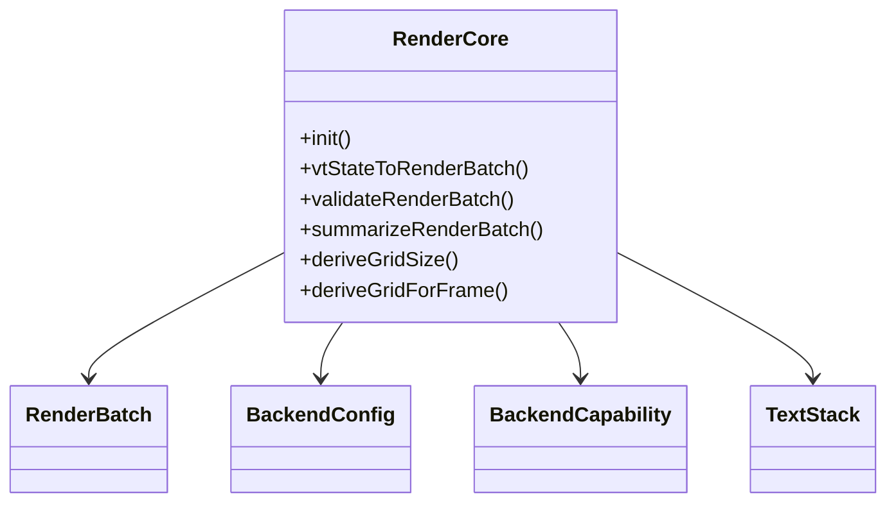
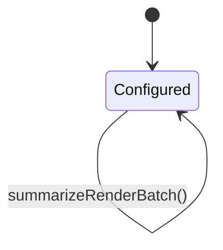
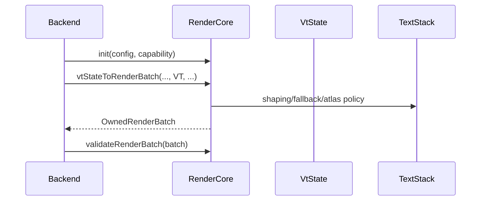

# Design

Shared rules: [`../../design/design-rules.md`](../../design/design-rules.md)

## Purpose
`howl-render-core` owns the backend-neutral rendering contract.

It turns render-facing terminal state into validated render batches and shared text-stack contracts.

## Public Surface
- `RenderCore`: main render-core owner.
- `TextStack`: shared text-stack owner.

## Ownership Rules
- `RenderCore` owns backend-neutral batch shapes and validation rules.
- `TextStack` owns shared atlas math, shaping policy, fallback policy, and special glyph logic.
- Backend repos should depend on these contracts, not re-invent them privately.

## Lifecycle

## Main Flows

## API Contracts
- `RenderCore` is a pure owner around render policy inputs.
- `vtStateToRenderBatch*` allocates owned batch buffers that callers must release.
- `validateRenderBatch` is the backend-facing contract check before render.
- `deriveGrid*` centralizes geometry policy shared by hosts/backends.

## Non-Goals
- GPU resource ownership.
- Platform GL/GLES contexts.
- Terminal PTY/session semantics.

## Change Rules
- New backend-visible contracts should land here first.
- Shared text shaping/raster policy belongs under `TextStack`.
- Backend repos should not fork batch validation rules privately.
