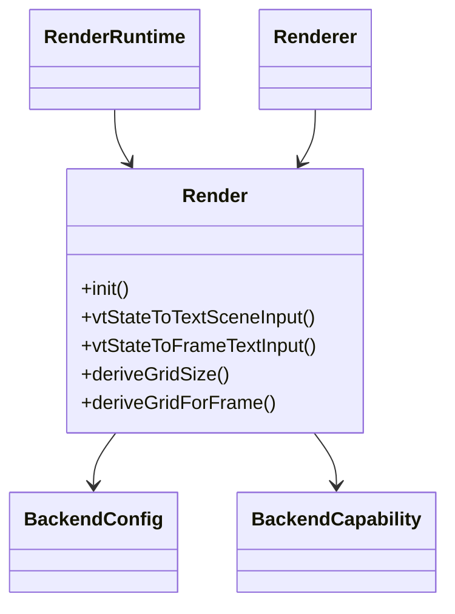
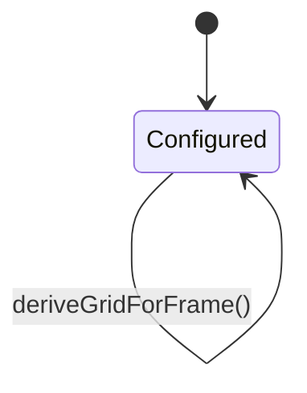
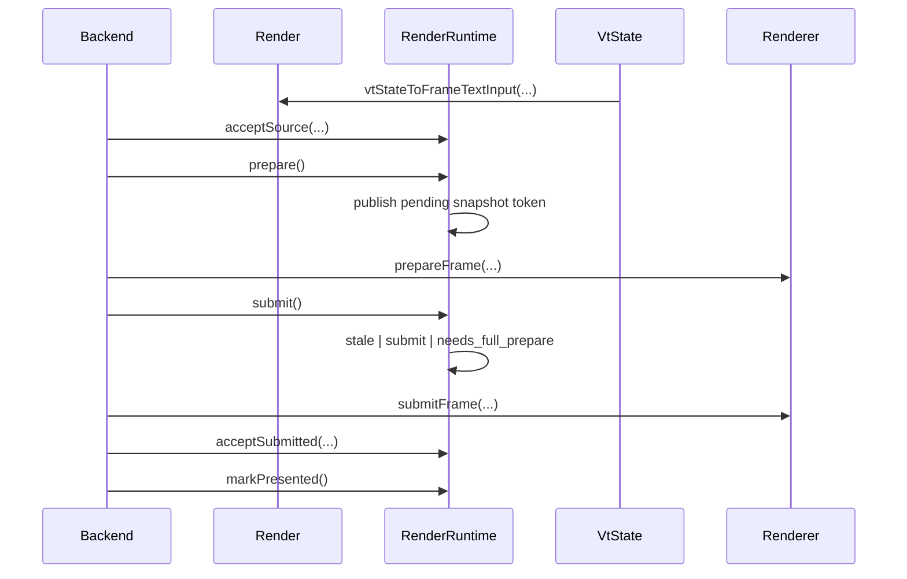

# Design

Shared rules: [`../../design/design-rules.md`](../../design/design-rules.md)

## Purpose
`howl-render` owns the backend-neutral rendering contract.

It turns render-facing terminal state into validated frame inputs, retained publication state, shared text contracts, and backend submission surfaces.

## Public Surface
- `Render`: main render owner.
- `Renderer`: selected backend owner surface.
- `Ffi`: C ABI translation surface when enabled.

## Ownership Rules
- `Render` is the public owner surface for render-facing types, VT conversion, geometry derivation, and runtime contracts.
- `Renderer` owns selected backend behavior and prepared-frame lifetime.
- `Render.Text` owns the public text support surface. `Render.Text.Lane` is the text-lane contract owner.
- `Ffi` translates ABI contracts only; it does not own render policy.
- `RenderRuntime` keeps retained publication mutation local before handing snapshot tokens to the frame queue.
- Backend repos should depend on these contracts, not re-invent them privately.
- `GlyphQuad` is final GPU submission data. It is not the shaping input model.
- Font and glyph decisions should flow through a kitty-style text path: cell text -> resolved runs -> shaped glyph groups -> sprite/atlas positions -> glyph quads.

## Lifecycle

## Main Flows

## API Contracts
- `Render` owns render-facing types, VT-to-frame/text conversion, and geometry derivation.
- `RenderRuntime` owns retained publication state, geometry epochs, prepare/submit queueing, and metrics.
- retained publication storage, source classification, and pending-publication state mutate in one local runtime owner path.
- queue state reports explicit prepare/submit transitions; runtime decides when rejected submit turns into a full-prepare request.
- runtime metric contracts live in `frame_metrics.zig`; queue transition counters mutate only at the queue transition that they count.
- `Renderer` owns backend selection, backend-facing prepare/submit behavior, and prepared-frame lifetime.
- `deriveGrid*` centralizes geometry policy shared by hosts/backends.
- text-lane contracts should be read through `Render.Text.Lane` and adjacent `Render.Text.Cluster` input types, not through duplicate `Render` aliases.
- Text contracts must represent whole cell text and shaped groups, not only isolated codepoints.
- Fallback contracts must validate whole cell text against selected faces.
- GL and GLES should consume the same metrics, resolver, and sprite-key contracts.

## Non-Goals
- GPU resource ownership.
- Platform GL/GLES contexts.
- Terminal PTY/session semantics.

## Change Rules
- New backend-visible contracts should land here first.
- Shared text shaping/raster policy belongs under `Render.Text`.
- Backend repos should not fork batch validation rules privately.
