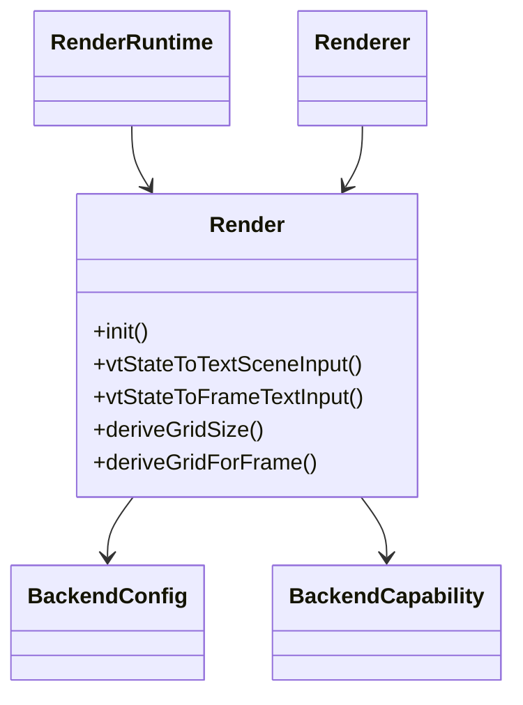
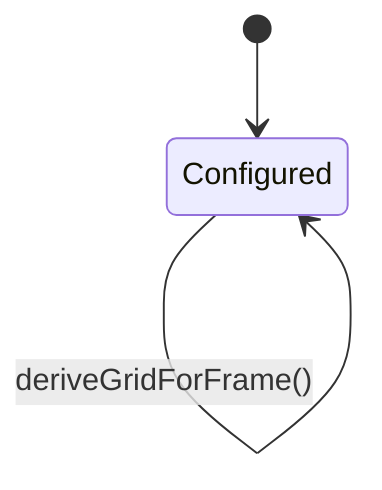
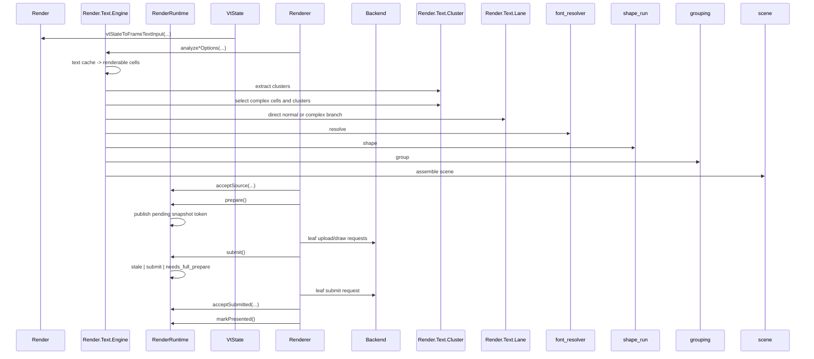

# Design

Shared rules: [`../design/design-rules.md`](../design/design-rules.md)

## Purpose
`howl-render` owns the backend-neutral rendering contract.

It turns render-facing terminal state into frame inputs, retained publication state, text contracts, and backend submission surfaces.

## Doc Set
- `design.md`: owner boundary, runtime flow, and proof surface.
- `special-glyphs.md`: generated special-glyph coverage table.

## Public Surface
- `include/howl_render.h`: C ABI header.
- `howl_render_*` exported symbols: C ABI contract for render runtime and renderer calls.
- The shipped embedding boundary is C ABI only.
- `src/howl_render.zig` is not an embedding surface. If it survives, it is repo-local only.
- Internal workspace wiring is not a public contract and is not a preservation target.
- Accepted cleanup results now locked:
  - `src/render_namespace.zig` is deleted
  - `src/howl_render.zig` is repo-local only
  - `build.zig` no longer preserves dual-surface or self-import posture
  - `src/libhowl_render.zig` is the explicit ABI export root
  - render handles in `include/howl_render.h` and `src/ffi.zig` are opaque-pointer-shaped
  - runtime convenience ABI exports `howl_render_runtime_has_pending_publication` and `howl_render_runtime_action` are deleted
  - ABI-handle wrapper ownership now stays in `src/ffi.zig`
  - non-render metadata no longer survives in `Render.SourceView`
  - stale repo-local observability passthroughs are removed
  - Linux host builds and runs on the cleaned render ABI path
- This checkpoint does not change the shipped ABI. `include/howl_render.h` and `howl_render_*` remain the only public surface.

## Ownership Rules
- `src/howl_render.zig` is repo-local only. It is not an embedding surface and not a preservation target for host integration shape.
- `Render` owns render-facing types, VT conversion, geometry derivation, retained-publication state, and runtime contracts behind the C ABI.
- `Renderer` owns selected backend behavior and prepared-frame lifetime.
- GL and GLES are leaf wrappers only. They may own external C-library glue, GPU objects, backend-local atlas storage, upload primitives, draw submission primitives, and true backend capability facts only.
- `Render.Text` owns the public text support surface. `Render.Text.Lane` is the text-lane contract owner.
- `Ffi` translates ABI contracts only. It owns ABI handle storage and marshalling, but not render policy.
- `RenderRuntime` keeps retained publication mutation local before handing snapshot tokens to the frame queue.
- Backend repos should depend on render contracts; they do not own render policy and must not re-invent it privately.
- `GlyphQuad` is final GPU submission data. It is not the shaping input model.
- Font and glyph decisions flow through one text path: cell text -> resolved runs -> shaped glyph groups -> sprite or atlas positions -> glyph quads.

## Lifecycle

## Main Flows

## API Contracts
- The public compatibility promise is the C ABI only.
- `include/howl_render.h` and `howl_render_*` exported symbols define the product surface.
- Hosts and embedders consume `howl-render` through that header and those exported symbols only.
- Zig root imports are not an acceptable host integration path and are not a preservation target.
- `Render` owns render-facing types, VT-to-frame/text conversion, and geometry derivation.
- `RenderRuntime` owns retained publication state, geometry epochs, prepare/submit queueing, and metrics.
- `RenderRuntime` does not own ABI handle boxes or renderer-side prepared-frame retention.
- retained publication storage, source classification, and pending-publication state mutate in one local runtime owner path.
- queue state reports explicit prepare/submit transitions; runtime decides when rejected submit turns into a full-prepare request.
- runtime metric contracts live in `frame_metrics.zig`; queue transition counters mutate only at the queue transition that they count.
- `Render.Text.Engine` owns the active text control spine: input acceptance, cluster extraction, lane branching, resolve, shape, grouping, and scene assembly.
- `Render.Text.Cluster` owns extraction and complex-path selection over text/cache/cell data, then stops.
- `grouping` owns grouping policy only.
- `scene` owns scene assembly only.
- `rasterizer` owns text sprite raster-request construction, request-list dedupe, generated special sprite raster policy, and raster execution contracts.
- `atlas_cache` owns sprite residency mutation: reserve slot, keep pending residency visible until raster completes, and mark entries rendered.
- `sprite_key` owns sprite output identity only; it does not own residency mutation.
- `Render.Text.Lane`, `font_resolver`, `shape_run`, `grouping`, and `scene` stay leaf phase owners under the engine spine; they do not own top-level routing.
- `Renderer` owns backend selection, backend-facing prepare/submit behavior, and prepared-frame lifetime.
- `Renderer` repo-local surface should expose only owner-true backend behavior. ABI handle boxes and font-path retention live in `src/ffi.zig`.
- backend root files are leaf wrappers only. They may translate renderer-owned requests into backend-local storage mutation, GPU upload steps, and draw submission steps, but they do not own render-policy control flow.
- backend internal atlas files own backend-local atlas storage and GPU upload mutation only. They do
  not own renderer text-engine atlas-state consequences after upload.
- backend internal provider files own FT/HB callback translation and backend-local cache wiring only.
- `deriveGrid*` centralizes geometry policy shared by hosts/backends.
- text-lane contracts should be read through `Render.Text.Lane` and adjacent `Render.Text.Cluster` input types, not through duplicate `Render` aliases.
- Text contracts must represent whole cell text and shaped groups, not only isolated codepoints.
- Fallback contracts must validate whole cell text against selected faces.
- GL and GLES should consume the same metrics, resolver, and sprite-key contracts.

## Text Spine
- Public text-engine entrypoints are the two options-bearing owners:
  - `Render.Text.Engine.analyzeCellsWithSessionOptions(...)`
  - `Render.Text.Engine.analyzeCellTextInputsOptions(...)`
- Direct normal path:
  - input acceptance
  - lane classification
  - direct normal draw assembly
  - scene result without resolve/shape/group phases
- Complex path:
  - sparse input preparation
  - `Render.Text.Cluster.extractClustersWithDamage(...)`
  - `Render.Text.Cluster.selectComplexWithDamage(...)`
  - `font_resolver.resolveClusters(...)`
  - `shape_run.shapeResolvedRunsWithShaper(...)`
  - `grouping.groupShapedRunsWithPolicy(...)`
  - `grouping.groupSpriteRoutes(...)`
  - `scene.buildSceneWithAtlasCacheOptions(...)`
  - `rasterizer.rasterizeRequestsWithRasterizer(...)`
- Scene assembly uses `atlas_cache.reserveRequest(...)` for residency mutation and `rasterizer.appendPendingRequest(...)` for raster request ownership; `scene.zig` no longer scans or mutates request state itself.
- Direct normal path uses `atlas_cache.reserve(...)` for glyph residency and keeps glyph raster requests local to the engine-owned fast path.
- `shape_run.defaultShaper()` still earns contract value because providers and tests can inject or reuse the default single-run shaper contract without re-owning the shaping phase.
- `scene.buildSceneWithOptions(...)` and `scene.buildSceneWithAtlasCacheOptions(...)` are the two remaining scene surfaces because caller-owned atlas residency is a real boundary difference.
- `provider.zig` and `ft_hb_provider.zig` stay callback-glue owners only. They supply shaper/raster/glyph callbacks but do not own raster policy or atlas residency policy.

## Backend Spine
- The current backend-root staged contract shape is not accepted architecture. Preserving it for compatibility or convenience fails review.
- Current backend-root move or deletion targets are exact:
  - `analyzeTextCellsOptions(...)`
  - `prepareFrame(...)`
  - `submitFrame(...)`
  - `renderTextScene(...)`
  - `renderFrameState(...)`
  - backend-root `deriveGridSize(...)`
  - backend-root `deriveGridForFrame(...)`
  - backend-root `resize(...)`
  - backend-root observability passthroughs `targetTexture()`, `resolveCounters()`, `surfaceHandle()`, and `lastResolveStage()`
- Current backend-root leaf contracts that may remain are exact:
  - `init(...)`
  - `deinit(...)`
  - `bindTargetTexture(...)`
  - `setFontPath(...)`
  - `setFallbackFontPaths(...)`
  - `setFontSizePx(...)`
  - `deriveFrameLayout(...)`
  - `textProvider(...)`
  - `fontSession(...)`
  - `capabilities(...)`
- `Renderer` must own staged prepare/submit orchestration and consume a smaller backend leaf contract instead of the reverse.
- backend-root upload/draw submission entrypoints may survive only as renamed or reduced leaf primitives; they are not preservation targets in their current staged shape.

## Renderer Sequencing
- `Renderer.prepareFrame(...)` is the owner of staged prepare sequencing.
- `Renderer.submitFrame(...)` is the owner of staged submit sequencing.
- the renderer/runtime handshake is exact:
  - prepare path:
    1. `Renderer` calls `RenderRuntime.prepare()`
    2. `Renderer` stops if the runtime returns no prepare request
    3. `Renderer` performs text analysis and raster planning
    4. `Renderer` records prepared-frame observability
    5. `Renderer` calls the backend upload leaf primitive
    6. `Renderer` records uploaded sprite residency on its own text-engine atlas state
    7. `Renderer` publishes prepared-frame metadata through `RenderRuntime.publishPrepared(...)`
  - submit path:
    1. `Renderer` calls `RenderRuntime.submit()`
    2. `Renderer` stops on `.idle`
    3. `Renderer` stops on `.stale` or `.needs_full_prepare` and lets runtime own the retry consequence
    4. `Renderer` consumes the matching prepared-frame record on `.submit`
    5. `Renderer` calls backend draw leaf work
    6. `Renderer` calls backend present/submit leaf work only if a distinct backend-finalization step is real
    7. `Renderer` records submitted-frame observability
    8. `Renderer` hands the final result to `RenderRuntime.acceptSubmitted(...)`
- `RenderRuntime.markPresented()` is a later host-owned presentation consequence, not part of submit-time renderer sequencing.
- `RenderRuntime` owns retained publication mutation, queue transitions, and runtime metrics only; it does not own prepared scene payloads or renderer-visible post-draw observability.
- renderer-owned prepared-frame records must hold:
  - runtime request token identity
  - geometry epoch
  - prepared text analysis payload
  - prepared scene/raster outputs
  - damage classification
  - renderer-owned resolve counters and resolve stage captured during prepare
  - prepared timings and render metrics inputs
- renderer-owned submitted-frame records must hold:
  - final surface handle built from runtime geometry plus draw-leaf target identity
  - draw/upload report counts
  - render timing outcome
  - final resolve observability copied from the prepared-frame owner record
- surviving backend calls under renderer sequencing are leaf operations only:
  - `fontSession(...)`
  - `textProvider(...)`
  - `bindTargetTexture(...)`
  - `deriveFrameLayout(...)`
  - `capabilities(...)`
  - `applyFrameGeometry(...)`
  - font configuration calls
  - `uploadTextSceneRaster(...)`
  - `drawPreparedScene(...)`
  - one present/submit primitive only if backend target finalization is a real distinct step

## Proof Surface
- `zig build test --summary all` is the proof umbrella.
- `zig build test:render` proves the pure render contract surface.
- `zig build test:unit` proves the integrated module surface, including text and backend behavior.
- `zig build test:runtime-proof` proves the retained runtime and staged renderer owner chain directly through `src/test/runtime_proof.zig`.
- backend test suites prove backend leaf behavior only: provider glue, upload/draw leaves, atlas/storage
  mutation, and backend-local geometry mutation.
- runtime proof is no longer hidden behind the package-root unit test surface.
- `zig build render-benchmark` runs the synthetic text-spine benchmark surface in `src/test/render_benchmark.zig`.
- Benchmark output names describe direct-normal and complex-path behavior; they should not use stale wrapper-era surface names.

## Non-Goals
- GPU resource ownership.
- Platform GL/GLES contexts.
- Terminal PTY/session semantics.

## Change Rules
- New backend-visible contracts should land here first.
- Shared text shaping/raster policy belongs under `Render.Text`.
- Backend repos should not fork batch validation rules privately.
